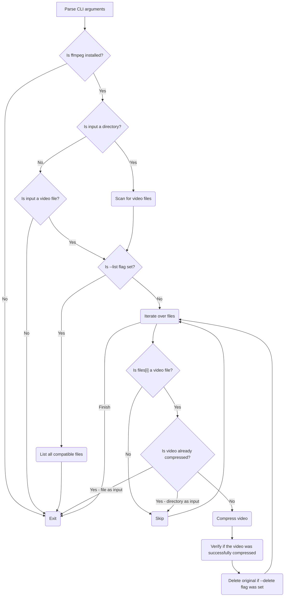

# Design doc: compy-cli

⬅️ [[compy-rs]]

**Version:** 0.1.0
**Status:** Draft
**Language:** Rust
**Core Dependency:** FFmpeg (System binary)

## 1. Overview

`compy-cli` is a command-line interface tool to compress videos using an opinionated FFmpeg command template. It can compress a single video or a bunch of them if a directory is passed through arguments.

## 2. User Interface (CLI)

The tool utilizes a standard POSIX-compliant flag structure.

| Argument/Flag   | Short | Long     | Required | Description                                                         |
| --------------- | ----- | -------- | -------- | ------------------------------------------------------------------- |
| `INPUT`         | N/A   | N/A      | Yes      | Path to a single video or a directory.                              |
| Delete original | -d    | --delete | No       | If set, delete original file only after successful compression.     |
| Dry Run / List  | -l    | --list   | No       | Lists the files to be processed and exits without compressing.      |
 
## 2.2 Usage examples

Compress a single video.

```bash
compy video.mp4
```

Compress all the videos within a directory, delete original files if success.

```bash
compy my_videos/ --delete
```

List all the videos that can be processed by the tool within a directory. Don't compress any video.

```bash
compy my_videos/ --list
```

## 3. Technical Architecture

### 3.1 Technology Stack (Crates)

- **`clap`**: For arguments parsing.
- **`walkir`**: For recursive directory traversal.
- **`std::process::Command`**: To invoke the `ffmpeg` command.

### 3.2 Data flow



## 4. Implementation details

### 4.1 Supported extensions (Whitelist)

The application should use a whitelist to avoid processing unsupported extensions. For example, a vector like this `["mp4", "mkv", "mov"]`

### 4.2 Naming convention

To avoid compressing a video twice, the application should use a naming convention for the output.

- **Input**: "video.mp4"
- **Output**: "video compressed.mp4"

In case the output file already exists, skip its processing.

### 4.3 The FFmpeg Command

The application must use the following harcoded FFmpeg command:

```bash
ffmpeg -i "{input_file}" -vcodec libx264 -crf 23 -acodec aac -b:a 128k -map_metadata 0 "{output_file}"
```

With the additional arguments to avoid unnecessary `ffmpeg` verbose information:

```bash
-v warning -hide_banner -stats
```

### 4.4 Rust Project Structure

```bash
compy-cli/
├── Cargo.toml
└── src/
    ├── main.rs         # Entry point, args parsing
    ├── scanner.rs      # Logic to find files/walk directories
    ├── processor.rs    # Logic to wrap Command::new("ffmpeg")
    └── utils.rs        # Helper functions (naming, checking ffmpeg existence)
```

## 5. Error Handling Strategy

1. Notify the user and exit the program in the following escenarios:
	1. If `ffmpeg` is not installed
	2. If the provided file or files are not in the whitelist
2. If the `ffmpeg` command returns an error, skip the delete process if the flag was set. Continue with the rest of the files, but exit the program with an error code. Notify the user about the issue.

## 6. Future Considerations

1. Configurable `crf`.
2. Configurable output container, e.g. `mp4` to `mkv`.
3. Parallel processing.
4. Progress bar (e.g. with [indicatif](https://github.com/console-rs/indicatif/tree/main))

## 7. Appendix

Prompt used to create a draft for this design doc.

```
OS: Linux

I want to build a rust cli tool to process video files using ffmpeg with the following features:
- Receive a file or a directory as argument
- Receive a flag to know if the original file/files/ must be deleted
- Receive a flag to know if it must list the files before starting the compression

Usage example:
---
compy-cli video.mp4
---
---
compy-cli path-to-videos/
---
I need you to provide a design doc for the features this cli tool needs in order to start working on it.
```
